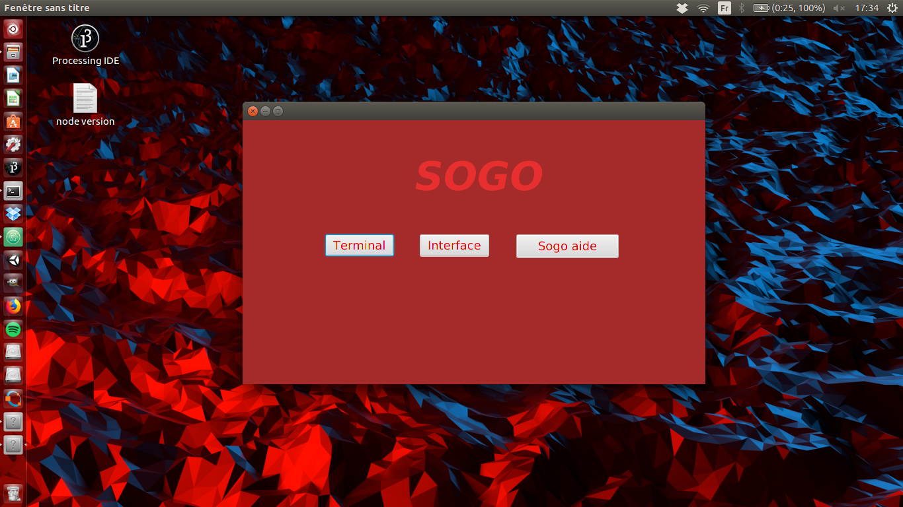
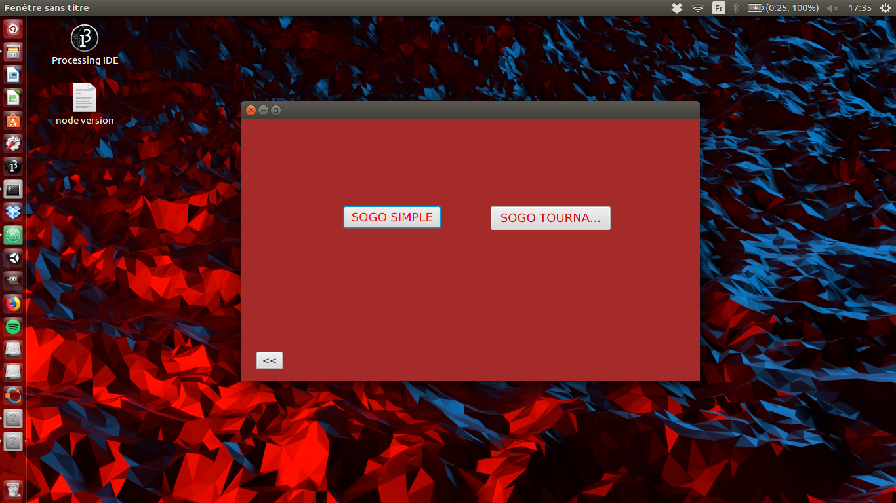
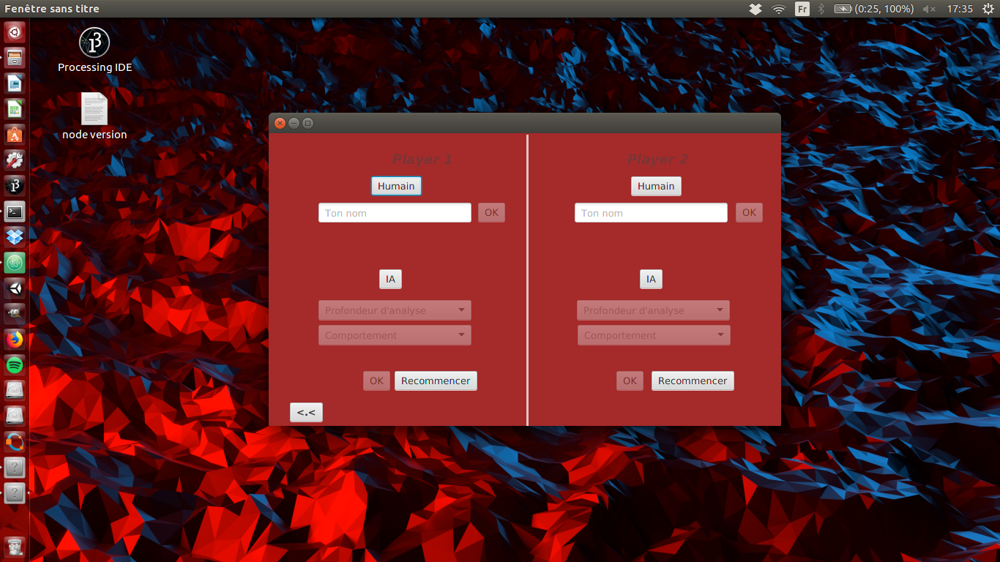
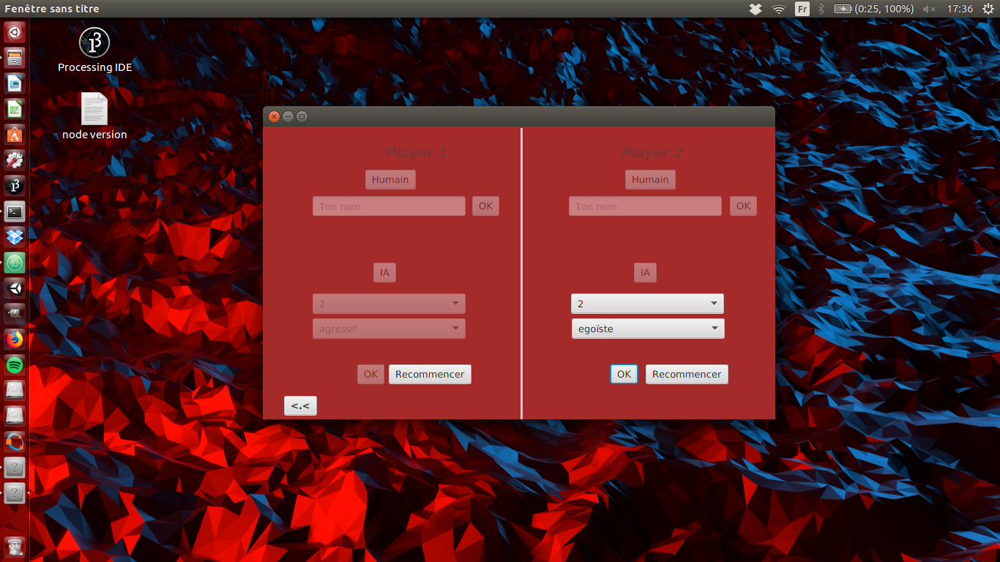
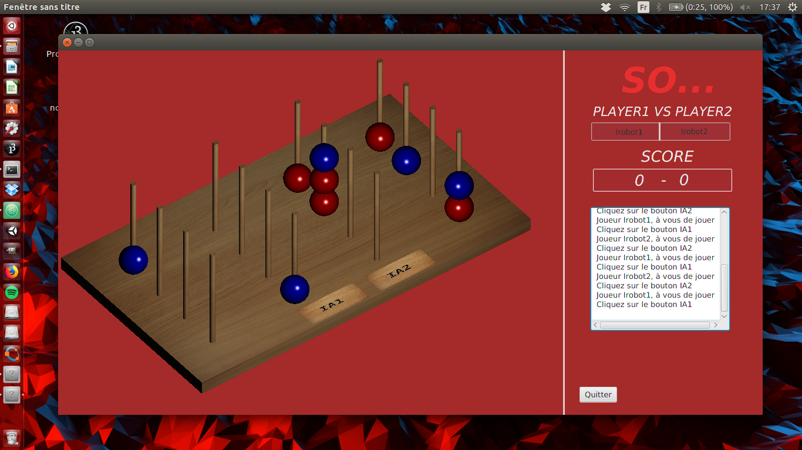
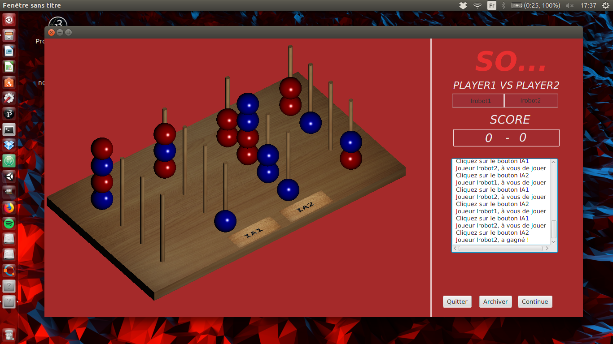
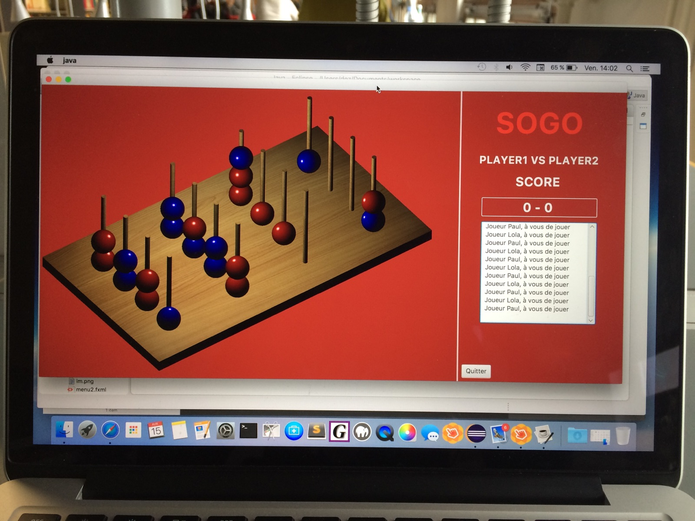

# 2016-Sogo-Puissance-4-3D-

Projet réalisé par :

* Desse Kande

* Jennifer Da Mata Tinoco

* Etienne Juan-Gesta

* Guillaume Lictevout

Dans le cadre de notre 2ème année de licence informatique à Paris 7 Diderot.

Les fichiers se trouvent dans trunk/Interface/src/application

J'ai travaillé sur l'IA principalement.

## Instructions

* Ouvrir le projet sous Eclipse

* Build & run le projet

* Vous pourrez choisir alors entre une version sur terminal et une version graphique

* (JavaFX est nécessaire, mais devrait être installé de base avec les versions récentes d'Eclipse)

## Présentation du jeu

* Le Sogo est un jeu dont le principe est le même que celui du Puissance 4, mais en 3 dimensions. Le plateau consiste en 16 piliers disposés en carré de 4 par 4 piliers, qui peuvent chacun recevoir 4 pions. Il constitue donc une sorte de cube de dimensions 4x4x4.

* Les joueurs jouent à tour de rôle et tous les alignements de 4 pions de même couleur débouchent sur la victoire du joueur auquel appartiennent ces pions. Il est à noter qu’en 3D il n’y a pas moins de 7 alignements possibles de 4 pions à partir de certaines positions.

* Variante Sogo tournant : cette variante vous permet de faire tourner dans le sens horaire les 4 piliers du milieu d’un quart de tour après avoir joué. Chaque joueur à le droit à 4 quart de tour durant la partie. Il est à noter que cette variante peut déboucher sur 2 joueurs ayant 4 pions alignés en même temps, ce qui amène à une égalité.

## Déroulement du jeu

* Le jeu vous propose soit la version interface graphique, soit terminal.

	* Version Interface :

	   * Un premier écran vous propose soit de commencer une nouvelle partie, soit de continuer une partie précédemment jouée, soit de lire une partie archivée (pour analyser les coups joués par exemple).

	   * Après avoir choisi la version du jeu (Simple ou Tournant), Cliquez sur “Humain” ou “IA” pour choisir le type de chacun des 2 joueurs. Choisissez ensuite le nom du joueur si Humain, ou paramétrez l’intelligence artificielle s’il s’agit d’une IA :

       * Le champ “Profondeur d’analyse” correspond au nombre de coups d’avance que l’IA va essayer de prévoir, et donc la difficulté.

       * Le champ “comportement” correspond au comportement de l’IA, c’est à dire si elle va d’abord chercher à vous bloquer avant de construire son jeu (agressif), ou au contraire d’abord s’occuper d’essayer de gagner avant de vous gêner (égoïste), ou bien essayer de combiner ces 2 stratégies au mieux (intelligent).

	   * Appuyez sur “Ok” dès que vous avez fini, et lorsque c’est fait pour les 2 joueurs, la partie se lance. Cliquez sur le pilier sur lequel vous voulez jouer lorsque c’est votre tour. Lorsque c’est à l’IA de jouer, cliquez sur le bouton correspondant à cette IA. En mode tournant, choisissez de faire pivoter ou non les piliers du centre après avoir joué.

	   * Vous pouvez quitter la partie à tout moment en cliquant sur “quitter” ou en quittant la fenêtre de jeu. Votre partie sera alors automatiquement sauvegardée, et vous pourrez la reprendre plus tard en cliquant sur “Continuer” lorsque vous lancez le jeu.

	   * Lorsqu’une partie est terminée, vous pouvez archiver la partie pour la revoir plus tard. Par exemple si vous voulez revoir une partie serrée jouée entre amis ou comprendre comment vous avez enfin réussi à battre cette IA en profondeur 3. Dans tous les cas vous pouvez ensuite continuer de jouer, et ainsi le score total est mis à jour, ou bien quitter la partie.

    * Version Terminal :

	   * Déroulement très proche du mode interface, mais en lignes de commande.

## Fonctionnalités

* Jeu de Sogo jouable.
* Terminal.
* Interface graphique 3D.
* Version Sogo tournant.
* Intelligence artificielle avec 3 comportements différents et 4 niveaux de difficulté.
* Sauvegarde si l’on quitte en cours de partie et possibilité de continuer la partie.
* Possibilité d’archiver une partie pour la revoir plus tard.
* Sauvegarde et affichage du score pour comparer le nombre de victoire (3 à 2, 5 à 1 etc…)

## Screenshots (à venir)

